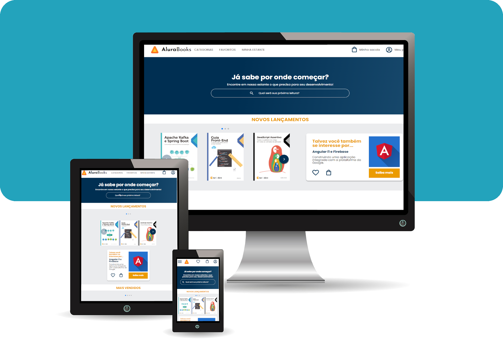
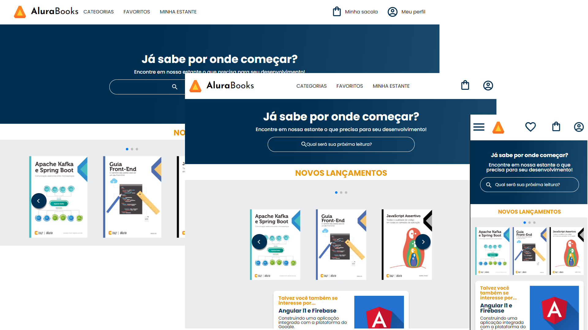

<h1 align="center">
  
Site AluraBooks com HTML CSS SASS usando a abordagem mobile-first

  
</h1>

  
  
  
  
  
  
  
  
  
  
  

  
  
  
  
  

  
  
  
  
  
  

## Introdução

É um projeto de uma pagina de livraria com metodologia mobile-first. Site totalmente responsivo com estrutura de header, banner, lançamentos, mais vendidos, tópicos visitados, input para cadastro e footer.

Utilizei HTML5, CSS3, Sass e JavaScript. Criei a pagina observando os requisitos do [layout Figma](https://www.figma.com/file/pcLDUtKkoDPXUQ2GCEC39t/AluraBooks).

>O site é responsivo se ajusta aos layouts de celular, tablet e desktop, utilizando as medidas:

* :iphone: `Ate 820PX Mobile e Tablet`
* :computer: `Entre 820PX e 1440PX Desktop Tela Pequena`
* :computer: `Maior que 1440 Desktop Tela Grande`

## :hammer: Funcionalidades do projeto
### Celular

### Tablet

### Desktop

## :heavy_check_mark: Técnicas e tecnologias utilizadas
  As técnicas utilizadas neste projeto foram:
  * HTML5
  * JavaScript
  * CSS3
  * SASS
  * Swiper para Slide
  * BEM (Block, Element, Modifier)
  * Padrão do código Prettier
  * IDE VsCode
  * Deloy [Vercel](https://site-alurabooks.vercel.app/) e [GitHub](https://livioalvarenga.github.io/Site_Alurabooks/)

  Utilizar o SASS foi um desáfio pessoal para o projeto, pois não estava no escopo do curso. Mas o fato de poder criar blocos separados e não repetir CSS foi o problema que busquei solucionar com SASS.

## :email: Contato

  Olá, eu sou Livio Alvarenga Engenheiro de Produção | Dev Back-end e Front-end. Sou aficcionado por tecnologia, programação, processos e planejamento, uni todas essas paixões em uma só profissão. Duvidas, sugestões e criticas são super bem vindas, segue meus contatos.

 * [www.livioalvarenga.com](https://livioalvarenga.com)
 * contato@livioalvarenga.com

## :warning: License

Este projeto é [MIT licensed](./LICENSE).

## :books: Mais informações do curso
Alura: [HTML e CSS: responsividade com mobile-first](https://cursos.alura.com.br/course/html-css-responsividade-mobile-first). 

## :smile: Agradecimento especial

A instrutora [Monica Hillman](https://linktr.ee/monicahillman) que lecionou um excelente curso e a [Alura](https://www.alura.com.br/). Muito Obrigado.

##### _#CompartilheConhecimento_
